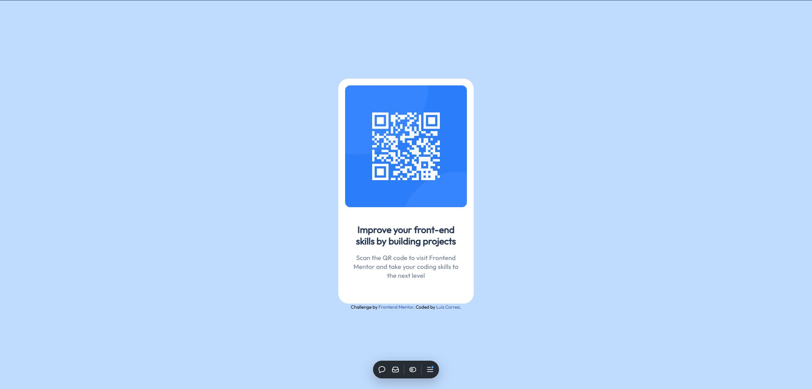

# Frontend Mentor - QR code component solution

This is a solution to the [QR code component challenge on Frontend Mentor](https://www.frontendmentor.io/challenges/qr-code-component-iux_sIO_H). Frontend Mentor challenges help you improve your coding skills by building realistic projects. 

## Table of contents

- [Overview](#overview)
  - [Screenshot](#solution)
  - [Links](#links)
- [My process](#my-process)
  - [Built with](#built-with)
  - [What I learned](#what-i-learned)
  - [Continued development](#continued-development)
  - [Useful resources](#useful-resources)
- [Author](#author)

**Note: Delete this note and update the table of contents based on what sections you keep.**

## Overview

### Solution



### Links

- Live Site URL: [QR Component Solution](https://qrcomponent-six.vercel.app/)

## My process

### Built with

- HTML5 markup
- CSS properties
- Flexbox
- Mobile-first workflow
- [Tailwind CSS](https://tailwindcss.com/) - For styles

### What I learned

While working on this project, I learned how to import external fonts and integrate them seamlessly into my designs. By using tools like Google Fonts, I now understand how to include custom typography in a project and style it effectively with Tailwind CSS. Here's an example of how I imported a font and applied it:  

```html
  <link rel="preconnect" href="https://fonts.googleapis.com">
  <link rel="preconnect" href="https://fonts.gstatic.com" crossorigin>
  <link href="https://fonts.googleapis.com/css2?family=Outfit&display=swap" rel="stylesheet">
```
I also deepened my understanding of Tailwind's basic functionality, including its utility-first approach to styling. By working with classes for layout, spacing, and typography, I became more comfortable with building responsive designs without writing custom CSS:

```html
<div class="card w-80 h-auto bg-white flex flex-col items-center justify-center text-center gap-6 pt-4 pr-4 pl-4 pb-10 rounded-3xl">
</div>
```

### Continued development  

In future projects, I want to focus on improving the structure and use of semantic HTML tags to ensure accessibility and better document flow. Additionally, I aim to refine my understanding and application of Tailwind CSS to design more efficient and responsive layouts. This includes exploring advanced utility classes and leveraging Tailwind's customization features to enhance productivity and design consistency. These improvements will help streamline development and result in cleaner, more maintainable code. 

### Useful resources

- [Tailwind CSS Documentation](https://tailwindcss.com/docs) - This is an essential resource for learning how to use and customize Tailwind CSS effectively. It provides detailed examples and best practices that have significantly improved my workflow.  
- [Google Fonts Guide](https://fonts.google.com/) - This page explains how to import external fonts into a project. It offers a simple and straightforward way to integrate custom fonts with Tailwind CSS or any other framework, making designs more unique and polished.  
- [MDN Web Docs on HTML Semantics](https://developer.mozilla.org/en-US/docs/Glossary/Semantics#semantics_in_html) - An excellent article that helped me understand the importance of semantic HTML and how to use the appropriate tags to improve accessibility and readability in projects.

**Note: Delete this note and replace the list above with resources that helped you during the challenge. These could come in handy for anyone viewing your solution or for yourself when you look back on this project in the future.**

## Author

- GitHub - [Luis Correa](https://www.your-site.com)
- Frontend Mentor - [@LuisCorreaDv](https://www.frontendmentor.io/profile/LuisCorreaDv)
- Linkedin - [Luis Correa](https://www.linkedin.com/in/luiscorrea-v/)


